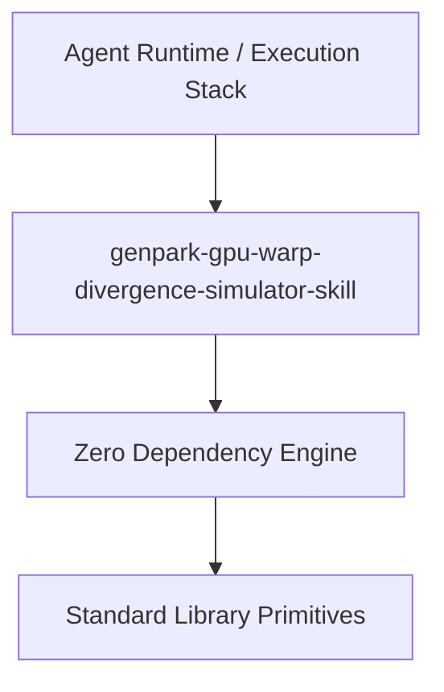

# genpark-gpu-warp-divergence-simulator-skill

[](https://github.com/alphaparkinc/genpark-gpu-warp-divergence-simulator-skill)
[](https://github.com/alphaparkinc/genpark-gpu-warp-divergence-simulator-skill)
[](https://www.python.org/)

SIMT GPU warp execution simulator tracking active thread divergence masks, reconvergence points, and warp vote intrinsics (__ballot_sync, __all_sync, __any_sync).



## Features
- **Strict 0 Pip Dependencies**: Built completely using the Python Standard Library.
- **Fast Execution & Verification**: Includes client wrapper, MCP server, and verified test suites.
- **Agentic AI Ready**: Exposes standard MCP tools for continuous LLM integration.

## Installation & Quickstart
```bash
git clone https://github.com/alphaparkinc/genpark-gpu-warp-divergence-simulator-skill.git
cd genpark-gpu-warp-divergence-simulator-skill
python example_usage.py
```
